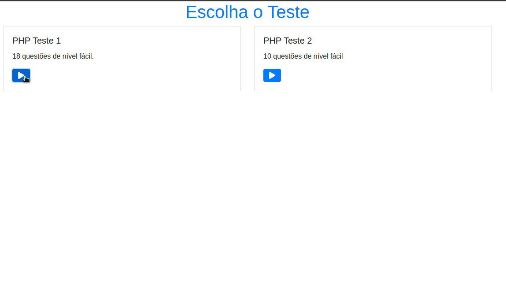

# teste-habilidade-php

Esse projeto contem alguns questionários em PHP pra você testar seu conhecimento.

## Exemplo  
  

### Como usar
1. Importe o arquivo teste_habilidade_php.sql que está na pasta database_seed para o seu banco de dados. 
2. Configure a conexão com o banco de dados no arquivo connection.php que está na pasta public.
3. Acesse a raíz da pasta do projeto pelo seu servidor web e escolha o questionário pra começar.
4. No seu navegador: localhost:8081

### Como usar com Docker Compose
1. Acesse a raiz do projeto através do terminal.
2. Rode o comando ```docker-compose up```
3. No seu navegador: localhost:8081
